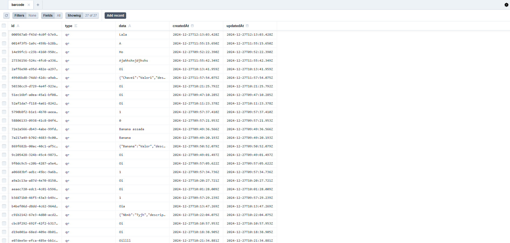
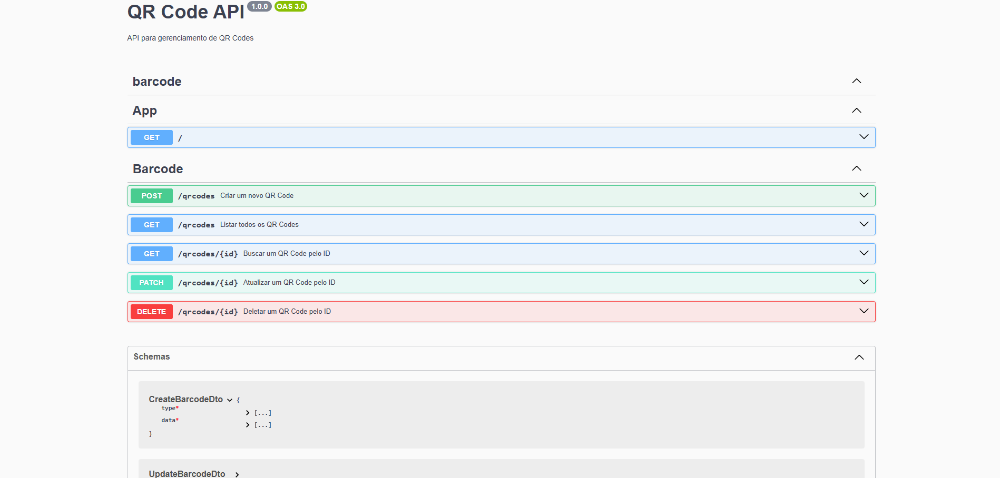

# mobile-app-react-native-qrcode
Aplicativo para leitura e cadastro de qrcodes.

## Pré-requisitos

Certifique-se de ter os seguintes softwares instalados em sua máquina:
- [wsl2](https://docs.microsoft.com/pt-br/windows/wsl/install)
- [Node.js](https://nodejs.org/)
- [Docker](https://www.docker.com/)
- [Docker Compose](https://docs.docker.com/compose/)
- [openjdk-21-jdk](https://openjdk.org/projects/jdk/21/)
- [Android Studio](https://developer.android.com/studio)
- [Android SDK](https://developer.android.com/studio)
- [Visual Studio Code](https://code.visualstudio.com/)


## Instalação do Backend
1. Clone o repositório
    ```bash
    git clone https://github.com/GravetoGeek/mobile-app-react-native-qrcode.git
    ```

2. Entre na pasta do projeto
    ```bash
    cd mobile-app-react-native-qrcode/backend
    ```
3. Instale as dependências
    ```bash
    npm install
    ```
4. Configure o arquivo .env

5. Suba os containers do docker
    ```bash
    docker compose up
    ```
    Serão iniciados os seguintes containers:

    - `backend`: Servidor Node.js com o código do projeto.
    - `database`: Banco de dados PostgreSQL para armazenar os dados da aplicação.
    - `migrations`: Container temporário para executar as migrações do Prisma.


6. Inicie o Prisma Studio
    ```bash
    npm run studio
    ```

    O Prisma Studio será aberto em seu navegador padrão na porta 5555. Você pode visualizar e gerenciar os dados do banco de dados usando a interface do Prisma Studio.

    

7. Acessar a documentação da API localmente.
    ```bash
    http://localhost:3000/docs
    ````
    Versão hospedada no Google Cloud Run
    ```bash
    https://backend-1097962137391.us-central1.run.app/docs
    ```

    A documentação da API será aberta em seu navegador padrão. Você pode visualizar e testar os endpoints da API usando a interface do Swagger.

    

## Scripts Disponíveis

No diretório `backend`, você pode executar os seguintes scripts:

- `npm run dev-all`: Executa as migrações do Prisma, inicia o servidor em modo de desenvolvimento e abre o Prisma Studio.
- `npm run chown`: Altera a propriedade dos arquivos no caminho especificado.
- `npm run dist`: Limpa a pasta `dist` e `node_modules`.
- `npm run migration`: Executa as migrações do Prisma dentro do container Docker.
- `npm run studio`: Inicia o Prisma Studio dentro do container Docker na porta 5555.


## Instalação do Frontend

1. Entre na pasta do projeto:
    ```bash
    cd mobile-app-react-native-qrcode/frontend
    ```

2. Instale as dependências:
    ```bash
    npm install
    ```
3. Configure o arquivo .env

4. Execute o projeto:
    ```bash
    npm run start
    ```

5. Escolha a opção `Run on Android device/emulator` para rodar o aplicativo em um dispositivo ou emulador Android.
É necessário que o Android Studio esteja configurado corretamente e o dispositivo/emulador esteja conectado.
A variável de ambiente `ANDROID_HOME` deve estar configurada para o diretório do Android SDK.

Caso deseje rodar o aplicativo em um dispositivo físico, siga as instruções [aqui](https://reactnative.dev/docs/running-on-device).


## Estrutura do Projeto

A estrutura do projeto é a seguinte:

```
.nvmrc
.vscode/
    extensions.json
api.http
backend/
📦src
 ┣ 📂barcode
 ┃ ┣ 📂core
 ┃ ┃ ┣ 📂application
 ┃ ┃ ┃ ┣ 📂ports
 ┃ ┃ ┃ ┗ 📂services
 ┃ ┃ ┃ ┃ ┗ 📜create-barcode.service.ts
 ┃ ┃ ┗ 📂domain
 ┃ ┃ ┃ ┣ 📂entities
 ┃ ┃ ┃ ┃ ┣ 📜barcode.entity.spec.ts
 ┃ ┃ ┃ ┃ ┗ 📜barcode.entity.ts
 ┃ ┃ ┃ ┗ 📂ports
 ┃ ┃ ┃ ┃ ┣ 📜barcode.repository.ts
 ┃ ┃ ┃ ┃ ┗ 📜create-barcode.usecase.ts
 ┃ ┣ 📂driven-adapters
 ┃ ┃ ┣ 📂config
 ┃ ┃ ┃ ┗ 📜swagger.config.ts
 ┃ ┃ ┗ 📂prisma
 ┃ ┃ ┃ ┗ 📜barcode-prisma-adapter.ts
 ┃ ┣ 📂driving-adapters
 ┃ ┃ ┣ 📂controllers
 ┃ ┃ ┃ ┣ 📜barcode.controller.spec.ts
 ┃ ┃ ┃ ┗ 📜barcode.controller.ts
 ┃ ┃ ┣ 📂dtos
 ┃ ┃ ┃ ┣ 📂validators
 ┃ ┃ ┃ ┃ ┗ 📜.gitkeep
 ┃ ┃ ┃ ┣ 📜barcode.dto.ts
 ┃ ┃ ┃ ┣ 📜create-barcode.dto.ts
 ┃ ┃ ┃ ┗ 📜update-barcode.dto.ts
 ┃ ┃ ┣ 📂gateways
 ┃ ┃ ┃ ┗ 📜.gitkeep
 ┃ ┃ ┗ 📂services
 ┃ ┃ ┃ ┣ 📜barcode.service.spec.ts
 ┃ ┃ ┃ ┗ 📜barcode.service.ts
 ┃ ┣ 📂providers
 ┃ ┃ ┗ 📜barcode.provider.ts
 ┃ ┗ 📜barcode.module.ts
 ┣ 📂common
 ┃ ┣ 📂core
 ┃ ┃ ┣ 📂application
 ┃ ┃ ┃ ┣ 📂in
 ┃ ┃ ┃ ┃ ┗ 📜.gitkeep
 ┃ ┃ ┃ ┗ 📂out
 ┃ ┃ ┃ ┃ ┗ 📜.gitkeep
 ┃ ┃ ┗ 📂domain
 ┃ ┃ ┃ ┣ 📂entities
 ┃ ┃ ┃ ┃ ┗ 📜.gitkeep
 ┃ ┃ ┃ ┣ 📂ports
 ┃ ┃ ┃ ┃ ┗ 📜.gitkeep
 ┃ ┃ ┃ ┗ 📂types
 ┃ ┃ ┃ ┃ ┣ 📜.gitkeep
 ┃ ┃ ┃ ┃ ┗ 📜json-or-string.type.ts
 ┃ ┣ 📂driven-adapters
 ┃ ┣ 📂driving-adapters
 ┃ ┃ ┣ 📂controllers
 ┃ ┃ ┃ ┣ 📜common.controller.spec.ts
 ┃ ┃ ┃ ┗ 📜common.controller.ts
 ┃ ┃ ┣ 📂dtos
 ┃ ┃ ┃ ┗ 📂validators
 ┃ ┃ ┗ 📂services
 ┃ ┃ ┃ ┣ 📜common.service.spec.ts
 ┃ ┃ ┃ ┗ 📜common.service.ts
 ┃ ┣ 📂providers
 ┃ ┃ ┣ 📜common.spec.ts
 ┃ ┃ ┗ 📜common.ts
 ┃ ┗ 📜common.module.ts
 ┣ 📂database
 ┃ ┣ 📂driven-adapters
 ┃ ┃ ┗ 📂prisma
 ┃ ┃ ┃ ┣ 📂migrations
 ┃ ┃ ┃ ┃ ┣ 📂20241222213734_init
 ┃ ┃ ┃ ┃ ┃ ┗ 📜migration.sql
 ┃ ┃ ┃ ┃ ┗ 📜migration_lock.toml
 ┃ ┃ ┃ ┣ 📜prisma.service.spec.ts
 ┃ ┃ ┃ ┣ 📜prisma.service.ts
 ┃ ┃ ┃ ┗ 📜schema.prisma
 ┃ ┗ 📜database.module.ts
 ┣ 📜app.controller.spec.ts
 ┣ 📜app.controller.ts
 ┣ 📜app.module.ts
 ┣ 📜app.service.ts
 ┗ 📜main.ts
frontend/
📦src
 ┣ 📂assets
 ┣ 📂components
 ┃ ┣ 📂atoms
 ┃ ┃ ┣ 📜Button.tsx
 ┃ ┃ ┣ 📜Icon.tsx
 ┃ ┃ ┣ 📜Image.tsx
 ┃ ┃ ┣ 📜InputField.tsx
 ┃ ┃ ┣ 📜Label.tsx
 ┃ ┃ ┗ 📜Text.tsx
 ┃ ┣ 📂molecules
 ┃ ┃ ┗ 📜.gitkeep
 ┃ ┗ 📂organisms
 ┃ ┃ ┣ 📜ContentWrapper.tsx
 ┃ ┃ ┗ 📜ShowQrcodeData.tsx
 ┣ 📂contexts
 ┣ 📂hooks
 ┃ ┣ 📜useCameraPermissions.test.tsx
 ┃ ┣ 📜useCameraPermissions.tsx
 ┃ ┣ 📜useQRScanner.test.tsx
 ┃ ┗ 📜useQRScanner.tsx
 ┣ 📂screens
 ┃ ┣ 📜Home.test.tsx
 ┃ ┣ 📜Home.tsx
 ┃ ┣ 📜QRCodeRegistration.test.tsx
 ┃ ┣ 📜QRCodeRegistration.tsx
 ┃ ┣ 📜QRCodeScanner.test.tsx
 ┃ ┗ 📜QRCodeScanner.tsx
 ┣ 📂services
 ┃ ┗ 📜qrcodeService.ts
 ┣ 📂store
 ┣ 📂styles
 ┃ ┣ 📂components
 ┃ ┃ ┣ 📂atoms
 ┃ ┃ ┃ ┗ 📜buttonStyle.tsx
 ┃ ┃ ┣ 📂molecules
 ┃ ┃ ┃ ┗ 📜.gitkeep
 ┃ ┃ ┗ 📂organisms
 ┃ ┃ ┃ ┣ 📜contentWrapperStyle.tsx
 ┃ ┃ ┃ ┗ 📜showQrcodeData.tsx
 ┃ ┣ 📂screens
 ┃ ┃ ┣ 📜homeStyle.tsx
 ┃ ┃ ┣ 📜qrCodeRegistrationStyle.ts
 ┃ ┃ ┗ 📜qrCodeScannerStyle.tsx
 ┃ ┣ 📜colors.tsx
 ┃ ┣ 📜globalStyles.tsx
 ┃ ┣ 📜spacing.tsx
 ┃ ┗ 📜typography.tsx
 ┣ 📂types
 ┃ ┗ 📜index.tsx
 ┗ 📂utils
        ...
LICENSE
README.md
```
### Arquitetura Hexagonal

Este projeto segue a arquitetura hexagonal (também conhecida como Arquitetura de Portas e Adaptadores), que promove a separação de preocupações e facilita a manutenção e evolução do software. A estrutura do projeto está organizada em camadas distintas:

- **Domain**: Contém as regras de negócio e entidades do domínio. Esta camada é independente de frameworks e bibliotecas externas.
- **Application**: Contém os casos de uso e serviços que orquestram a lógica de negócio. Esta camada depende apenas da camada de domínio.
- **Infrastructure - Driven Adapters**: Contém implementações específicas de infraestrutura, como repositórios de dados, serviços externos e configurações. Esta camada depende das camadas de domínio e aplicação.
- **Interfaces - Driving Adapters**: Contém as interfaces de entrada e saída, como controladores de API, interfaces de usuário e adaptadores de comunicação.

### Benefícios da Arquitetura Hexagonal

1. **Isolamento de Dependências**: A arquitetura hexagonal isola a lógica de negócio das dependências externas, facilitando a substituição de tecnologias e frameworks sem impactar o núcleo do sistema.

2. **Testabilidade**: A separação de preocupações permite testar cada camada de forma independente, aumentando a cobertura de testes e a confiabilidade do software.

3. **Flexibilidade e Extensibilidade**: A estrutura modular facilita a adição de novas funcionalidades e a adaptação do sistema a novos requisitos, promovendo a evolução contínua do software.

4. **Manutenibilidade**: A organização clara do código torna mais fácil entender e modificar o sistema, reduzindo o tempo e o esforço necessários para realizar manutenções.

5. **Reutilização de Código**: A lógica de negócio encapsulada na camada de domínio pode ser reutilizada em diferentes contextos, como interfaces de usuário, APIs e serviços de backend.

Ao seguir essas boas práticas, garantimos que o projeto seja robusto, escalável e fácil de manter, proporcionando uma base sólida para o desenvolvimento contínuo e a evolução do software.

## Contribuição

1. Faça um fork do projeto
2. Crie uma nova branch (`git checkout -b feature/nova-feature`)
3. Faça commit das suas alterações (`git commit -am 'Adiciona nova feature'`)
4. Faça push para a branch (`git push origin feature/nova-feature`)
5. Abra um Pull Request

## Licença

Este projeto está licenciado sob a licença MIT. Veja o arquivo [LICENSE](LICENSE) para mais detalhes.